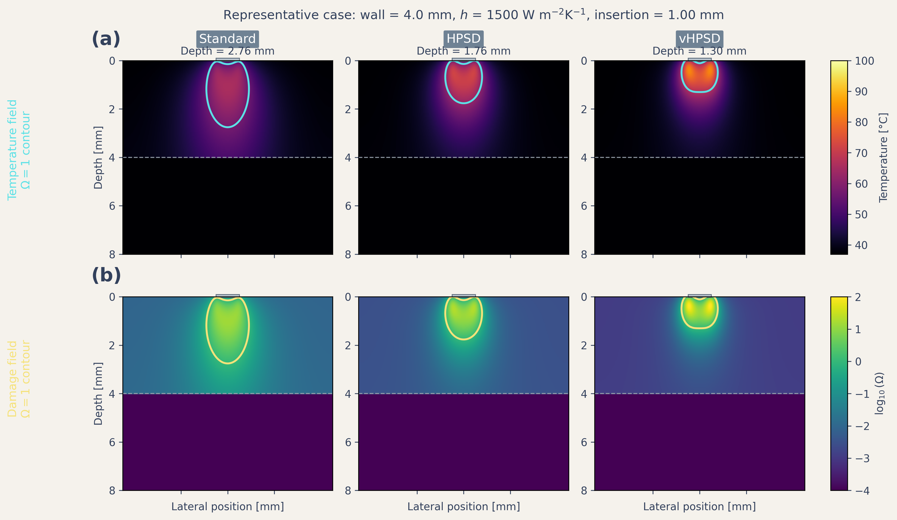
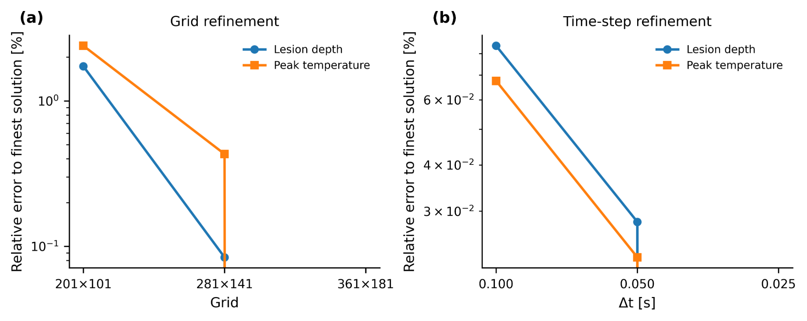
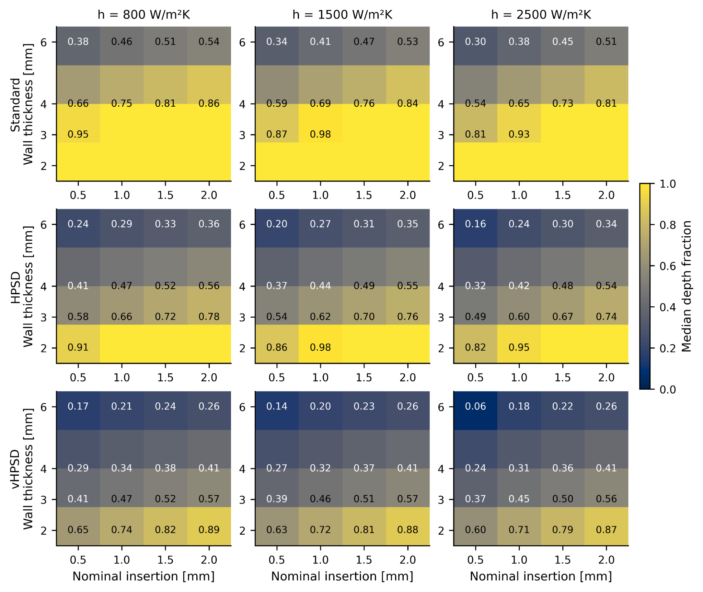
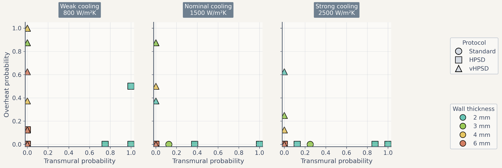
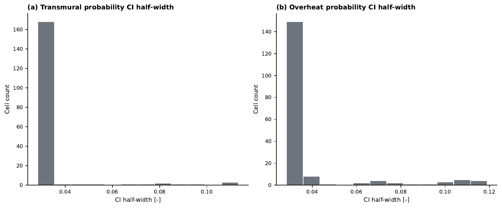

**Corresponding author:** to be completed before submission.

## Abstract

**Background:** Reduced-complexity electro-thermal models may offer a practical route to comparative radiofrequency (RF) ablation analysis on modest hardware, provided that assumptions, uncertainty inputs, and probability-estimation uncertainty are reported transparently.

**Objective:** To develop a reduced two-dimensional uncertainty-aware model for comparing standard RF, high-power short-duration (HPSD), and very-high-power short-duration (vHPSD) lesion formation across wall thickness, contact surrogate, and surface-cooling conditions.

**Methods:** A vertically contacting electrode-blood-myocardium model was implemented using a quasi-static electrical solve, transient bioheat transfer, and Arrhenius thermal damage. Deterministic sweeps were performed over wall thickness, nominal cooling coefficient, insertion depth as a contact surrogate, and three protocol classes (30 W/30 s, 50 W/10 s, and 90 W/4 s). The regularized unit-potential Joule source was scaled to the applied power and modulated by insertion depth through explicit source-gain and local cooling-reduction rules. Reported outputs included lesion depth, maximum width, lesion area, depth fraction, depth-to-width ratio, peak temperature, transmurality, and an overheating proxy based on temperatures >= 100 C. Uncertainty propagation treated insertion depth and cooling coefficient as truncated-normal inputs and used 64 stratified samples per nominal cell; transmurality and overheating probabilities were reported with 95% Wilson-score confidence intervals.

**Results:** Deterministically, lesion penetration and lesion extent ranked standard RF > HPSD > vHPSD. Under the baseline nominal condition, lesion depth/width/area were 2.76 mm/3.82 mm/8.66 mm^2 for standard RF, 1.76 mm/3.15 mm/4.47 mm^2 for HPSD, and 1.30 mm/2.69 mm/2.63 mm^2 for vHPSD. In the uncertainty-aware maps, standard RF occupied the broadest transmurality-success region, HPSD reached a narrower thin-wall / higher-contact regime, and vHPSD remained predominantly non-transmural while showing the greatest overheating susceptibility in thin-wall, weak-cooling, high-contact conditions. Median 95% Wilson half-widths were 0.028 for transmurality probability and 0.028 for overheating probability. A literature-derived benchmark reproduced the protocol-level depth ranking reported experimentally but underestimated absolute lesion depth under the nominal reduced-model setup.

**Conclusions:** The proposed reduced 2D framework provides an interpretable and low-cost method for comparative lesion mapping and uncertainty-aware risk visualization. Under the present assumptions, standard RF retained the highest transmural potential, HPSD occupied an intermediate regime, and vHPSD remained shallowest while most susceptible to overheating. The framework is intended for comparative methodology-focused analysis rather than patient-specific lesion prediction.

**Keywords:** radiofrequency catheter ablation; electro-thermal modeling; uncertainty quantification; transmural lesion formation; HPSD; vHPSD

## 1. Introduction

Radiofrequency catheter ablation remains a standard thermal strategy for creating irreversible myocardial injury in the treatment of cardiac arrhythmias. Lesion size and shape are governed by the interplay among delivered power, application duration, catheter-tissue contact, local cooling, and tissue thickness [5,7,8]. Classical bioheat and thermal-injury models have long been used to study these mechanisms [1-4,24], while contemporary cardiac-ablation reviews show that computational modeling now spans simplified two-dimensional studies, irrigated-electrode models, dynamic contact models, and broader multiphysics frameworks [5-8].

High-power short-duration strategies have drawn particular interest because they alter the balance between resistive and conductive heating [9,12-21]. Experimental and clinical studies indicate that HPSD can shorten RF delivery time while maintaining lesion efficacy in selected contexts [18-21]. At the same time, lesion geometry is protocol dependent: computer and experimental studies have shown that increasing power while shortening duration does not simply scale lesion depth proportionally, and vHPSD lesions may remain relatively shallow in thick myocardium [9-11,14-17]. In temperature-controlled 90 W/4 s ablation, lesion size also appears to saturate once contact force exceeds approximately 15 g [10].

For methodology development on modest hardware, however, full three-dimensional or catheter-specific models are often too expensive for broad parameter sweeps. Reduced models remain useful if they are explicit about what they can and cannot represent. Earlier work has shown, for example, that simplified models may predict lesion depth and maximum tissue temperature reasonably well while failing to reproduce blood temperature and surface-width behavior in irrigated-tip settings [8]. Likewise, a dynamic-contact RFCA model showed that under selected moderate-contact conditions, heartbeat-induced displacement could be approximated by an average static insertion depth for lesion-depth prediction [6]. These observations support the present strategy: a reduced two-dimensional framework oriented toward comparative lesion mapping rather than patient-specific lesion prediction.

The specific gap addressed here is not the absence of another deterministic lesion simulator, but the lack of an inexpensive uncertainty-aware framework for protocol-level risk mapping under uncertain contact and cooling conditions. Electrophysiologists are often interested in questions such as: under what combinations of wall thickness, contact, and cooling is a protocol likely to become transmural, and where does the same protocol begin to incur appreciable overheating risk? These questions are more naturally answered by probability maps and trade-off summaries than by isolated deterministic contours.

Accordingly, this study develops a reduced 2D electro-thermal model to compare a conventional protocol (30 W/30 s), an HPSD protocol (50 W/10 s), and a vHPSD protocol (90 W/4 s). Deterministic sweeps are first used to characterize lesion depth, width, area, and temperature trends across wall thickness, insertion depth, and cooling. Uncertainty propagation over contact surrogate and cooling then generates transmurality-probability maps, overheating-probability maps, and depth-fraction summaries. The central hypothesis is that standard RF will occupy the broadest transmural-success region, HPSD will show an intermediate thin-wall regime, and vHPSD will remain shallower while showing greater overheating susceptibility under thin-wall, high-contact conditions.

## 2. Methods

### 2.1 Reduced two-dimensional electro-thermal lesion model

We considered a reduced two-dimensional cross-sectional model composed of a vertically contacting electrode footprint, the adjacent blood-pool boundary, a myocardial wall, and a lower thermal buffer. The objective was comparative lesion analysis rather than catheter-specific reproduction of irrigation jets, chamber-scale flow, or feedback-controlled temperature regulation.

The electrical subproblem was solved in quasi-static form:

$$\nabla \cdot (\sigma \nabla \phi) = 0$$

where $\phi$ is electric potential and $\sigma$ is electrical conductivity. A unit-potential solution was first obtained, and the corresponding unit Joule source was computed as:

$$q_{\mathrm{unit}} = \sigma \left|\nabla \phi\right|^2$$

The thermal problem was represented using a transient bioheat formulation:

$$\rho c \frac{\partial T}{\partial t} = \nabla \cdot (k \nabla T) + q_{\mathrm{RF}} - \omega_b \rho_b c_b (T - T_b)$$

where $T$ is temperature, $\rho$ density, $c$ specific heat, and $k$ thermal conductivity. In the present implementation, the perfusion term was set to zero, so that blood-mediated cooling entered primarily through the surface boundary condition. Thermal injury was quantified using the Arrhenius damage integral:

$$\Omega(t) = \int_0^t A \exp\!\left(-\frac{E_a}{R T(\tau)}\right) d\tau$$

and lesion boundary was defined by $\Omega \ge 1$ [1-4,24].

### 2.2 Geometry and computational domain

The domain width was 18 mm. Physical myocardial wall thickness was varied from 2 to 6 mm. An additional 4 mm lower thermal buffer was included to reduce boundary contamination, but this buffer was excluded from lesion metrics. The electrode footprint at the tissue surface was represented by a 2-mm-wide top boundary segment. The baseline production grid for the 4-mm wall case used 281 x 141 nodes, with the number of depth nodes rescaled proportionally for other wall-thickness settings.

### 2.3 Boundary and initial conditions

The lower boundary of the electrical domain was grounded, the electrode segment at the top surface was assigned a unit potential, and the remaining top-surface and lateral boundaries were electrically insulated. For the thermal problem, the lateral and lower boundaries were zero-flux. The top surface was subject to an effective convective condition with nominal coefficient $h_{\mathrm{nom}}$, representing combined blood-pool and catheter-adjacent cooling in reduced form. The initial temperature was 37 C throughout the domain.

### 2.4 Power scaling and contact surrogate implementation

Three protocol classes were compared: standard RF (30 W/30 s), HPSD (50 W/10 s), and vHPSD (90 W/4 s). Contact was represented using insertion depth $d_{\mathrm{ins}}$ rather than explicit force. In the model implementation, the unit Joule source was first smoothed with a Gaussian kernel and shifted in depth according to:

$$\Delta y = \alpha_{\mathrm{shift}} \, d_{\mathrm{ins}}$$

where $\alpha_{\mathrm{shift}} = 0.25 \; \mathrm{mm/mm}$. The regularized source `q_reg` was then scaled to the applied power according to:

$$q_{\mathrm{RF}} = \kappa_P \, P \, S_c(d_{\mathrm{ins}}) \; \frac{q_{\mathrm{reg}}}{\int q_{\mathrm{reg}} \, dA}$$

where $P$ is the protocol power, $\kappa_P = 6.8 \; \mathrm{W \, m^{-1}}$ per applied watt is the calibrated source-amplitude coefficient, and the contact-gain factor is:

$$S_c(d_{\mathrm{ins}}) = \max\!\left(0.5, 1 + \beta_P (d_{\mathrm{ins}} - d_{\mathrm{ref}})\right)$$

with $d_{\mathrm{ref}} = 1.0 \; \mathrm{mm}$ and $\beta_P = 0.16 \; \mathrm{mm^{-1}}$. Thus, larger insertion depths increase the effective source strength while preserving the regularized spatial pattern.

Contact also modified local cooling over the electrode footprint. On the footprint, the effective convective coefficient was:

$$h_{\mathrm{foot}} = h_{\mathrm{nom}} \, S_h(d_{\mathrm{ins}})$$

with

$$S_h(d_{\mathrm{ins}}) = \mathrm{clip}\!\left(1 - \beta_h (d_{\mathrm{ins}} - d_{\mathrm{ref}}), \; h_{\min}, \; h_{\max}\right)$$

where $\beta_h = 0.35 \; \mathrm{mm^{-1}}$, $h_{\min}=0.50$, and $h_{\max}=1.40$. Outside the electrode footprint, the surface coefficient remained equal to $h_{\mathrm{nom}}$. This construction allowed the contact surrogate to affect both local source intensity and local cooling in a transparent reduced-order manner.

### 2.5 Material parameters and lesion metrics

Baseline material parameters were $\sigma = 0.6 \; \mathrm{S/m}$, $k = 0.55 \; \mathrm{W \, m^{-1} K^{-1}}$, $\rho = 1050 \; \mathrm{kg \, m^{-3}}$, and $c = 3600 \; \mathrm{J \, kg^{-1} K^{-1}}$. The Arrhenius parameters were $A = 7.39 \times 10^{39} \; \mathrm{s^{-1}}$ and $E_a = 2.577 \times 10^5 \; \mathrm{J \, mol^{-1}}$. Reported outputs were lesion depth, maximum lesion width, lesion area, depth fraction (depth/wall thickness), depth-to-width ratio, transmurality, peak temperature, and the area exposed to temperatures >= 100 C.

### 2.6 Numerical implementation and verification

The model was implemented in Python using a finite-difference discretization on structured grids. The unit-potential electrical problem and the implicit heat step were solved at each case using sparse linear algebra. Grid convergence was assessed using 201 x 101, 281 x 141, and 361 x 181 grids for the 4-mm baseline case. Time-step convergence was assessed using 0.10 s, 0.05 s, and 0.025 s. The selected production settings were 281 x 141 and $\Delta t = 0.05 \; \mathrm{s}$.

### 2.7 Deterministic sweeps

Deterministic sweeps were performed across protocol, wall thickness, nominal cooling coefficient, and nominal insertion depth. Wall thickness values were 2, 3, 4, 5, and 6 mm. Nominal cooling coefficients were 800, 1500, and 2500 W m^-2 K^-1. Nominal insertion depths were 0.5, 1.0, 1.5, and 2.0 mm. These sweeps were summarized using lesion depth, maximum width, lesion area, peak temperature, depth fraction, and depth-to-width ratio.

### 2.8 Uncertainty quantification

Insertion depth and cooling coefficient were treated as uncertain inputs. For each nominal wall-thickness x cooling x insertion x protocol cell, insertion depth and cooling coefficient were sampled independently using truncated normal distributions. Insertion depth was assigned a standard deviation of 0.20 mm and truncated to [0.25, 2.50] mm. Cooling coefficient was assigned a coefficient of variation of 0.15 and truncated to [300, 4000] W m^-2 K^-1. Each marginal distribution was sampled with 64 stratified draws per cell using an $8 \times 8$ stratified design with independent within-stratum randomization, after which the two variables were paired by randomized permutation. Transmurality and overheating probabilities were reported together with 95% Wilson-score confidence intervals [4,23]. Supplementary Figure S3 summarizes the resulting confidence-interval half-width distributions.

### 2.9 Literature-derived benchmark

Because no geometry-matched experimental dataset was available, external comparison was limited to a protocol-level literature-derived benchmark. The benchmark was used to assess whether the reduced model reproduced the experimentally reported ranking of lesion depth across standard RF, HPSD, and vHPSD protocols [9,15]. This comparison is therefore interpreted as trend-level benchmarking rather than strict validation.

**Table 1. Protocol definitions used throughout the deterministic and uncertainty-aware analyses.**

| Protocol | Power (W) | Duration (s) | Nominal energy (J) | Role in comparison |
|---|---:|---:|---:|---|
| Standard RF | 30 | 30 | 900 | Conventional long-duration comparator |
| HPSD | 50 | 10 | 500 | Intermediate high-power short-duration comparator |
| vHPSD | 90 | 4 | 360 | Very-high-power short-duration comparator |

**Table 2. Solver, contact-surrogate, and uncertainty settings used for the production analyses.**

| Item | Value |
|---|---|
| Deterministic production grid | 281 x 141 |
| Time step | 0.05 s |
| Wall thickness levels | 2.0, 3.0, 4.0, 5.0, 6.0 mm |
| Nominal cooling coefficients | 800, 1500, 2500 W m^-2 K^-1 |
| Nominal insertion levels | 0.5, 1.0, 1.5, 2.0 mm |
| UQ samples per nominal cell | 64 |
| Insertion-depth distribution | truncated normal, SD 0.20 mm, support [0.25, 2.50] mm |
| Cooling-coefficient distribution | truncated normal, CV 0.15, support [300, 4000] W m^-2 K^-1 |
| Probability intervals | 95% Wilson score |
| Overheating proxy threshold | T >= 100 C |
| Contact power gain coefficient | 0.16 mm^-1 |
| Contact cooling-reduction coefficient | 0.35 mm^-1 |

## 3. Results

### 3.1 Deterministic protocol comparisons

Under the nominal baseline condition (4-mm wall thickness, insertion depth 1.0 mm, cooling coefficient 1500 W m^-2 K^-1), lesion extent ranked standard RF > HPSD > vHPSD across depth, width, and area. The baseline depth/width/area values were 2.76 mm/3.82 mm/8.66 mm^2 for standard RF, 1.76 mm/3.15 mm/4.47 mm^2 for HPSD, and 1.30 mm/2.69 mm/2.63 mm^2 for vHPSD. Peak temperature showed the opposite ordering, with vHPSD generating the hottest local response. Thus, the deterministic comparisons did not simply identify a depth ranking, but a broader lesion-geometry ordering across protocols.

### 3.2 Effects of wall thickness, insertion depth, and cooling

Increasing wall thickness reduced depth fraction across all protocols. Standard RF approached or reached transmurality in the 2-3 mm regime, whereas HPSD reached this regime only under a smaller subset of thin-wall / stronger-contact settings and vHPSD remained predominantly subtransmural across the scanned parameter space. Increasing insertion depth increased lesion depth, width, area, depth-to-width ratio, and peak temperature for all protocols. Increasing nominal cooling reduced lesion extent and peak temperature. These trends were consistent across multiple geometry metrics and therefore do not depend on depth alone.

### 3.3 Numerical verification

Grid- and time-step-refinement studies showed that the selected production settings were stable for the baseline case. Relative changes in lesion depth and peak temperature were small between the selected and finer settings, supporting the use of the selected grid and time step for the deterministic and uncertainty-aware sweeps.

### 3.4 Uncertainty-aware transmurality and overheating maps

The uncertainty-aware maps showed that standard RF occupied the broadest transmurality-success region. HPSD occupied an intermediate region concentrated in thin-wall settings with greater nominal insertion depth. vHPSD remained predominantly non-transmural across the scanned cells. In contrast, overheating probability was concentrated mainly in vHPSD, especially under thin-wall, weak-cooling, high-contact conditions, while standard RF remained negligible in the current reduced model. Thus, the probability maps exposed a trade-off between deeper penetration and thermal-risk susceptibility that was not fully apparent from deterministic depth alone.

### 3.5 Confidence intervals on probability estimates

For the production uncertainty maps, each nominal cell was evaluated with 64 stratified samples. Wilson-score confidence intervals were computed for all transmurality and overheating probabilities. Supplementary Figure S3 shows that most cells had relatively narrow confidence-interval half-widths, while a smaller set of near-transition cells retained larger uncertainty bounds. The median 95% Wilson half-widths were 0.028 for transmurality probability and 0.028 for overheating probability, with maxima of 0.113 and 0.119, respectively.

### 3.6 Literature-derived benchmark

The protocol-level literature benchmark reproduced the experimentally reported ranking in lesion depth: standard RF deepest, HPSD intermediate, and vHPSD shallowest. However, the reduced model underestimated the absolute lesion depth values relative to the literature points under the nominal reduced-model setup. Accordingly, the benchmark supports the present framework as a trend-level comparative model rather than a geometry-matched predictive model.

{ width=95% }

{ width=100% }

{ width=100% }

{ width=88% }

{ width=100% }

{ width=100% }

{ width=88% }

**Table 3. Literature-derived protocol-level benchmark points used in Figure 8.**

| Source / matched point | Protocol | Reported depth (mm) | Simulated depth (mm) | Reported width (mm) | Simulated width (mm) |
|---|---|---:|---:|---:|---:|
| Nakagawa2021 | Standard RF | 6.6 | 2.76 | 10.7 | 3.82 |
| Nakagawa2021 | HPSD | 4.9 | 1.76 | 9.2 | 3.15 |
| Nakagawa2021 | vHPSD | 3.6 | 1.30 | 8.2 | 2.69 |

{ width=92% }

## 4. Discussion

This study presents a reduced two-dimensional electro-thermal framework for comparing standard RF, HPSD, and vHPSD lesion formation across wall thickness, contact surrogate, and cooling conditions. The main contribution is not the deterministic depth ranking itself—which is unsurprising given the protocol definitions—but the uncertainty-aware framework that maps comparative transmurality success and overheating susceptibility across uncertain contact and cooling settings.

A first key finding is that the deterministic ordering remained stable across multiple geometry metrics: standard RF produced the deepest, widest, and largest-area lesions; HPSD occupied an intermediate position; and vHPSD remained shallowest. The addition of width, area, and depth-to-width ratio directly addresses the concern that the model might otherwise privilege standard RF through depth-only reporting. Under the present nominal settings, the geometric ranking remained consistent across all three metrics.

A second key finding is that uncertainty-aware maps exposed a sharper trade-off than deterministic summaries alone. Standard RF occupied the broadest transmural-success region, HPSD reached transmurality only in a narrower thin-wall / higher-contact regime, and vHPSD remained mostly non-transmural while showing the highest overheating susceptibility under thin-wall, weak-cooling, high-contact conditions. These findings should be interpreted as comparative model outputs under the present reduced assumptions, not as general clinical claims. In particular, the model does not reproduce catheter-specific temperature-control logic, explicit irrigation-jet flow, or chamber-scale hemodynamics [7-10,15-19].

The revised uncertainty workflow materially improved probability transparency. Earlier exploratory maps used low sample counts and produced strongly quantized probability patterns. In the present manuscript, the production maps are based on 64 stratified samples per nominal cell, and probability uncertainty is reported through Wilson-score confidence intervals. Supplementary Figure S3 confirms that most cells have modest interval half-widths, while cells near transition regimes still retain broader uncertainty bounds. This makes the probability maps more defensible as comparative risk summaries.

The literature-derived benchmark should also be interpreted cautiously. The current comparison is protocol-matched rather than geometry-matched and therefore should not be described as strict validation. The reduced model reproduced the protocol-level ranking but underestimated absolute lesion depth under the nominal setup. This underprediction is consistent with the simplified nature of the model, which omits explicit irrigation physics, catheter-specific temperature control, and richer chamber-scale flow [7,8].

The present study has several limitations. First, the model is two-dimensional and reduced-complexity rather than anatomy-matched. Second, the contact surrogate is insertion-depth-based and does not include explicit mechanics, even though contact area and lesion size are known to be closely linked [22]. Third, cooling is represented by an effective surface heat-transfer coefficient rather than explicit blood or irrigation flow [7,8]. Fourth, the external benchmark remains limited in size. Finally, the overheating proxy is based on temperatures reaching or exceeding 100 C and should not be interpreted as a mechanistic steam-pop or char model [24].

Despite these limitations, the framework remains useful as a low-cost comparative tool for protocol mapping on limited hardware. Future work should include catheter-specific temperature-control logic, richer cooling surrogates or explicit local flow, broader protocol-matched benchmarking, and stronger geometry-matched validation. In that role, the present model can serve as an efficient screening tool that complements rather than replaces higher-fidelity simulations and experiments.

## 5. Conclusion

A reduced two-dimensional electro-thermal model was developed to compare standard RF, HPSD, and vHPSD protocols under uncertain contact and cooling conditions. Across deterministic and uncertainty-aware analyses, lesion penetration ranked standard RF > HPSD > vHPSD, while overheating susceptibility was concentrated primarily in vHPSD. The revised uncertainty workflow, based on 64 stratified samples per nominal cell and Wilson-score confidence intervals, strengthened the interpretability of the resulting risk maps. The literature-derived benchmark reproduced the protocol-level depth ranking but underestimated absolute lesion depth, indicating that the present framework is most appropriate for comparative and uncertainty-aware protocol mapping rather than patient-specific quantitative lesion prediction.

## Data availability

Code, frozen figures, benchmark assets, and manuscript materials are organized in the accompanying project repository and paper package.

## Funding

To be completed before submission.

## Acknowledgements

To be completed before submission.

## Conflict of interest

The authors declare no scientific conflicts related to this methodology-focused computational study. Administrative declarations will be finalized before submission.

## References

1. Pennes HH. Analysis of tissue and arterial blood temperatures in the resting human forearm. *J Appl Physiol*. 1948;1:93-122.
2. Henriques FC Jr. Studies of thermal injury V. The predictability and significance of thermally induced rate processes leading to irreversible epidermal injury. *Arch Pathol*. 1947;43:489-502.
3. Arrhenius S. On the reaction velocity of the inversion of cane sugar by acids. *Z Phys Chem*. 1889;4:226-248.
4. Wilson EB. Probable inference, the law of succession, and statistical inference. *J Am Stat Assoc*. 1927;22:209-212.
5. González-Suárez A, Pérez JJ, Irastorza RM, D'Avila A, Berjano E. Computer modeling of radiofrequency cardiac ablation: 30 years of bioengineering research. *Comput Methods Programs Biomed*. 2022;214:106546. doi:10.1016/j.cmpb.2021.106546.
6. Pérez JJ, Nadal E, Berjano E, González-Suárez A. Computer modeling of radiofrequency cardiac ablation including heartbeat-induced electrode displacement. *Comput Biol Med*. 2022;144:105346. doi:10.1016/j.compbiomed.2022.105346.
7. González-Suárez A, Berjano E. Computational modeling of open-irrigated electrodes for radiofrequency cardiac ablation including blood motion-saline flow interaction. *PLoS One*. 2016;11:e0150356. doi:10.1371/journal.pone.0150356.
8. González-Suárez A, Pérez JJ, Berjano E. Should fluid dynamics be included in computer models of RF cardiac ablation by irrigated-tip electrodes? *Biomed Eng Online*. 2018;17:43. doi:10.1186/s12938-018-0471-4.
9. Nakagawa H, Ikeda A, Sharma T, Govari A, Ashton J, Maffre J, et al. Comparison of in vivo tissue temperature profile and lesion geometry for radiofrequency ablation with high power-short duration and moderate power-moderate duration: effects of thermal latency and contact force on lesion formation. *Circ Arrhythm Electrophysiol*. 2021;14:e009899. doi:10.1161/CIRCEP.121.009899.
10. Yamaguchi J, Takigawa M, Goya M, Martin CA, Negishi M, Yamamoto T, et al. Impact of contact force on the lesion characteristics of very high-power short-duration ablation using a QDOT-MICRO catheter. *J Arrhythm*. 2024;40:247-255. doi:10.1002/joa3.12992.
11. Iwakawa H, et al. Lesion depth optimization in high-power radiofrequency ablation: evaluating single high-power and combined very high-power applications. *J Cardiovasc Electrophysiol*. 2025;36:3212-3223. doi:10.1111/jce.16643.
12. Kotadia ID, Williams SE, O'Neill M. High-power, short-duration radiofrequency ablation for the treatment of AF. *Arrhythm Electrophysiol Rev*. 2019;8:265-272.
13. Petras A, Leoni M, Guerra JM, Jansson J, Gerardo-Giorda L. Systematic characterization of high-power short-duration ablation: insight from an advanced virtual model. *Europace*. 2021;23:1587-1596. doi:10.1093/europace/euab103.
14. Irastorza RM, d'Avila A, Berjano E. Thermal latency adds to lesion depth after application of high-power short-duration radiofrequency energy: results of a computer-modeling study. *J Cardiovasc Electrophysiol*. 2018;29:322-327. doi:10.1111/jce.13363.
15. Reddy VY, Grimaldi M, De Potter T, et al. Pulmonary vein isolation with very high power, short duration, temperature-controlled lesions: the QDOT-FAST trial. *JACC Clin Electrophysiol*. 2019;5:778-786. doi:10.1016/j.jacep.2019.04.009.
16. Rozen G, Ptaszek LM, Zilberman I, Douglas V, Heist EK, Beeckler C, et al. Safety and efficacy of delivering high-power short-duration radiofrequency ablation lesions utilizing a novel temperature sensing technology. *Europace*. 2018;20:f444-f450. doi:10.1093/europace/euy031.
17. Barkagan M, Contreras-Valdes FM, Leshem E, et al. High-power and short-duration ablation for pulmonary vein isolation: safety, efficacy, and long-term durability. *J Cardiovasc Electrophysiol*. 2018;29:1287-1296. doi:10.1111/jce.13651.
18. Chieng D, et al. Higher power short duration vs. lower power longer duration posterior wall ablation for atrial fibrillation and oesophageal injury outcomes: a prospective multi-centre randomized controlled study (Hi-Lo HEAT trial). *Europace*. 2023;25:417-425. doi:10.1093/europace/euac194.
19. Jin S, Lin W, Fang X, et al. High-power, short-duration ablation under the guidance of relatively low ablation index values for paroxysmal atrial fibrillation: long-term outcomes and characteristics of recurrent atrial arrhythmias. *J Clin Med*. 2023;12:971. doi:10.3390/jcm12030971.
20. Liu X, et al. Safety and efficacy of high power shorter duration ablation guided by ablation index or lesion size index in atrial fibrillation ablation: a systematic review and meta-analysis. *J Interv Card Electrophysiol*. 2021;62:535-545. doi:10.1007/s10840-021-00923-7.
21. Amin AM, et al. Efficacy and safety of high-power short-duration ablation for atrial fibrillation: a systematic review and meta-analysis of randomized controlled trials. *J Interv Card Electrophysiol*. 2024. doi:10.1007/s10840-024-01782-2.
22. Masnok K, et al. Catheter contact area strongly correlates with lesion area in radiofrequency cardiac ablation. *Sci Rep*. 2021;11:17009. doi:10.1038/s41598-021-96455-1.
23. Fahrenholtz SJ, Bjornsson CS, et al. Generalized polynomial chaos based uncertainty quantification for planning MRgLITT procedures. *Int J Hyperthermia*. 2014;30:54-63.
24. Chang IA. Considerations for thermal injury analysis for RF ablation devices. *Open Biomed Eng J*. 2010;4:3-12. doi:10.2174/1874120701004010003.

## Appendix A. Supplementary figures

{ width=100% }

{ width=88% }

{ width=88% }
